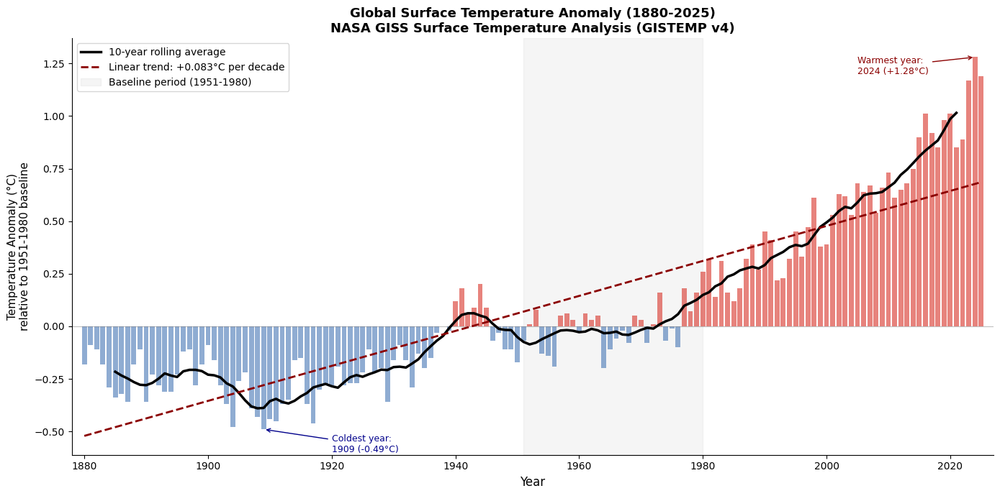
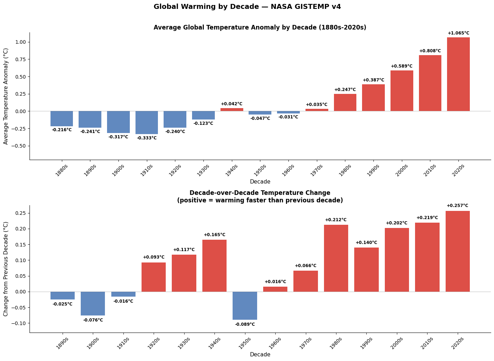
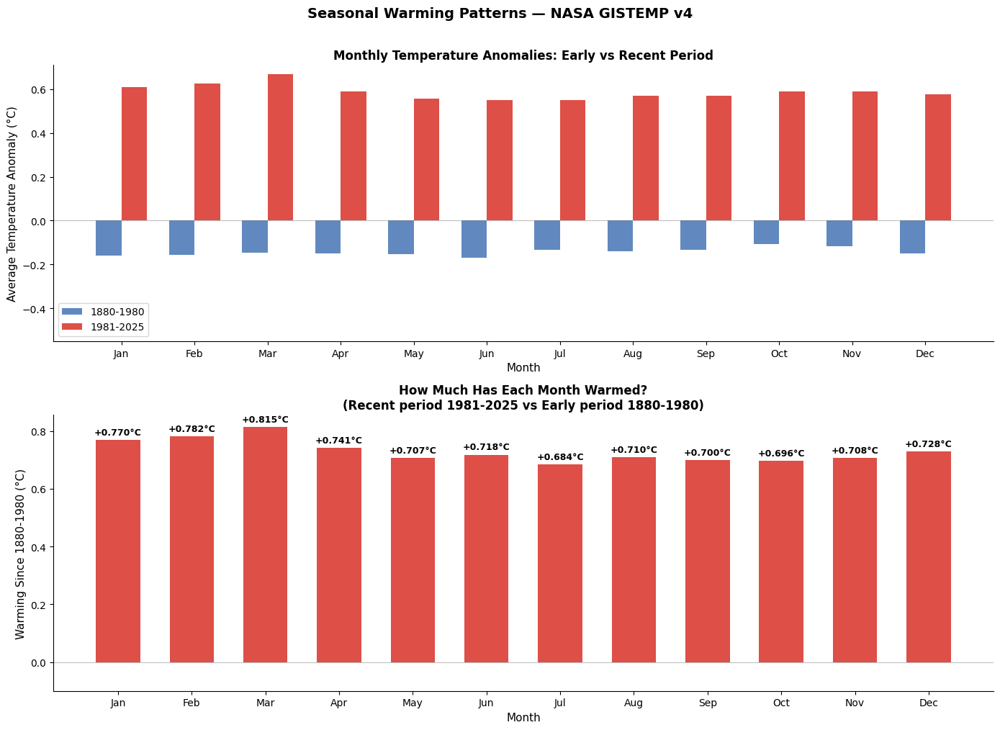
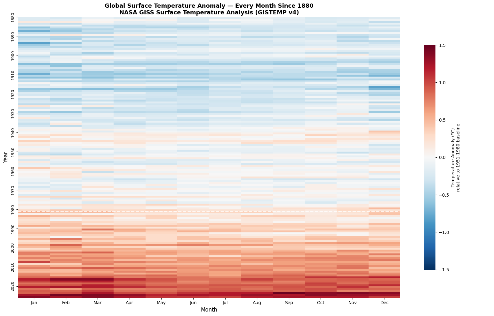

# NASA GISS Surface Temperature Analysis
### Global Temperature Anomalies 1880–2026 using Python and pandas

**Author:** Emma Follis  
**Data source:** [NASA GISS Surface Temperature Analysis (GISTEMP v4)](https://data.giss.nasa.gov/gistemp/)  
**Tools:** Python, pandas, numpy, scipy, matplotlib, seaborn  
**Last updated:** June 2026

[](https://colab.research.google.com/drive/1j3v8VOTM6MVfarrO05IjYTeroV0Jp_TK?usp=sharing)

---

## Overview

This project analyzes NASA's GISS Surface Temperature dataset — one of the most cited 
climate records in the world, maintained by NASA's Goddard Institute for Space Studies. 
The dataset tracks global surface temperature anomalies relative to a 1951–1980 baseline, 
covering 146 complete years from 1880 to 2025.

A positive anomaly means that year was warmer than the baseline average. A negative 
anomaly means cooler. The analysis covers four questions:

1. How has global temperature changed since 1880?
2. Which decades were warmest and how fast is warming accelerating?
3. Are all months warming equally or are some seasons changing faster?
4. What does the complete month-by-month picture look like since 1880?

---

## Key Findings

**Overall trend:** Global surface temperature has risen at +0.0832°C per decade since 
1880, with an R² of 0.767 and a p-value of 2.35e-47 — statistically indistinguishable 
from zero probability of occurring by chance.

**Warmest years:** The 10 warmest years on record are all from 2015-2025. Not one year 
before 2015 appears in the top 10. The warmest single year is 2024 at +1.28°C above 
baseline.

**Coldest years:** The 10 coldest years are all clustered between 1903-1917, with 1909 
at -0.49°C being the coldest on record.

**Accelerating warming:** Each decade since the 1980s has warmed faster than the one 
before it. The 2020s (6 years of data) are already the warmest decade on record at 
+1.065°C above baseline — a +0.257°C jump from the 2010s, the largest single-decade 
acceleration in the record.

**Seasonal patterns:** All 12 months have warmed between +0.684°C and +0.815°C since 
1880-1980. Winter months (January-March) show slightly greater warming than summer 
months, consistent with the well-documented pattern of polar amplification — cold 
seasons and high latitudes warming faster than tropical regions.

---

## Visualizations

### The Full Temperature Record (1880-2025)


### Decade-by-Decade Warming and Acceleration


### Seasonal and Monthly Breakdown


### Monthly Temperature Heatmap — Every Month Since 1880


---

## Repository Structure
NASA_GISS_Temperature_Analysis/

├── NASA_GISS_Temperature_Analysis.ipynb   # Full analysis notebook

├── temperature_record.png                 # Visualization 1

├── decade_warming.png                     # Visualization 2

├── seasonal_breakdown.png                 # Visualization 3

├── monthly_heatmap.png                    # Visualization 4

└── README.md                              # This file
---

## How to Run

**Option 1 — Google Colab (recommended):**  
Click the Open in Colab badge above. Download the GISTEMP v4 global temperature 
data from [NASA GISS](https://data.giss.nasa.gov/gistemp/tabledata_v4/GLB.Ts+dSST.csv) 
and upload it when prompted.

**Option 2 — Local:**
```bash
pip install pandas numpy scipy matplotlib seaborn
jupyter notebook NASA_GISS_Temperature_Analysis.ipynb
```
Download the data CSV from the NASA GISS link above.

---

## Data Notes

- Dataset: NASA GISS Surface Temperature Analysis (GISTEMP v4)
- Temperature anomalies relative to 1951-1980 baseline
- Retrieved: June 2026
- 146 complete years (1880-2025) plus partial 2026 data
- Missing values marked as *** in source file — handled via pandas cleaning
- 2026 excluded from annual analysis as the year is incomplete

---

## What I Learned

This project demonstrates end-to-end data analysis in Python including data cleaning 
with pandas, linear regression with scipy, rolling averages with numpy, period 
comparison analysis, and four distinct visualization types including a heatmap. 
The dataset required real cleaning work — handling NASA's *** missing value markers 
and non-standard number formatting — before any analysis was possible.

---

## About

Built as part of a scientific data analysis portfolio by Emma Follis, a data analyst 
with a background in Earth and Planetary Science. Currently completing an M.S. in 
Space Studies at American Public University while contributing to NASA's Exoplanet 
Watch citizen science program.

[LinkedIn](https://www.linkedin.com/in/emma-follis) | 
[GitHub](https://github.com/AstroAstra)
